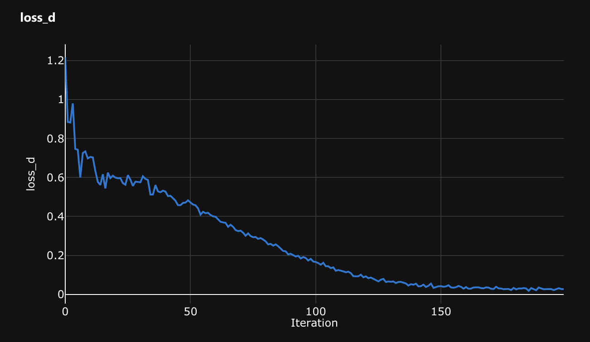

# dashcam_gan

My attempt at a Generative Adversarial Network in PyTorch using my car dashcam video data. I had a some dashcam video footage from which I pulled ~26,000 frames of images to use as training data. I trained the model using Microsoft Azure's Machine Learning service.

Example sample image:


Example Output Images from Epoch 51


Discriminator Loss


Generator Loss


## Results
The discriminator ended up being too good for the generator, and learned much faster than the generator could keep up. The generator ended up having the best results around epochs 30-60. Based on some light research, if I were to continue working on this, I could try changing:
- the loss function for the discriminator https://developers.google.com/machine-learning/gan/problems
- the architectures of the discriminator to make it less powerful or the generator to make it more powerful
- the hyperparameters
- when the discriminator or generator are trained and updated

## Install
```
conda install pytorch torchvision -c pytorch
pip install azureml-sdk opencv-python
```

## Setting up
Load your image data into ```data/image_data_train/1```, ie by running

```
python get_image_frames_from_videos.py
```

## Running locally
Run ```src/azure/dashcam_gan.py```


## Running on Microsft Azure
I followed this tutorial series to run the script on the Microsoft Azure: https://docs.microsoft.com/en-us/azure/machine-learning/tutorial-1st-experiment-sdk-setup-local

1. Fill out ```src/create_workplace_template.py``` with your account credentials and run it
2. Run ```src/check_images.py```
3. Run ```src/upload_data.py```
4. Run ```src/run_dashcam_gan.py```
